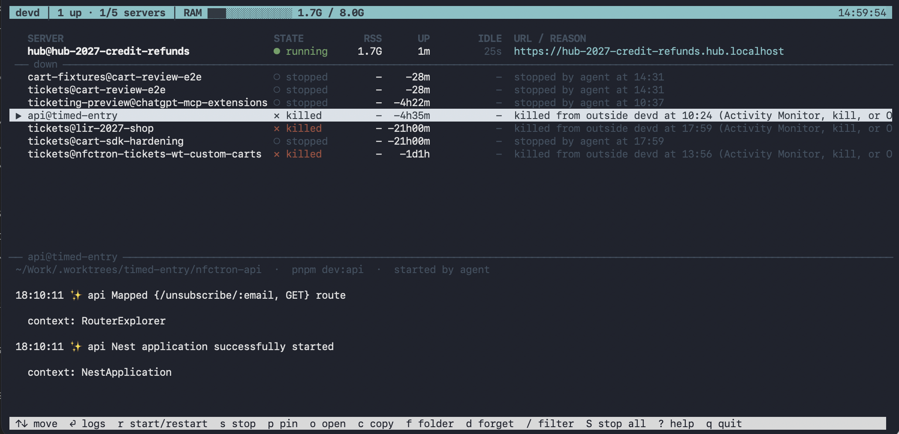

# devd

**A supervisor for local dev servers, built for working with coding agents.**

[Project page](https://ditrich.me/devd) · [Setup guide](docs/setup.md) · [Configuration](docs/configuration.md) · [How it works](docs/how-it-works.md)

[](https://github.com/filipditrich/devd/actions/workflows/ci.yml)


[](LICENSE)

Coding agents (Cursor, Claude Code, Codex, and anything running them, such as Orca) start dev servers all day. They put them in background shells nobody can see, fight over port 3000, start a second copy of something that is already running, quietly restart the server you just killed because it was eating 6 GB, and leave a dozen `next dev` processes behind when the session ends.

devd gives every local dev server one owner. Agents and you both start servers with `devd up`. devd runs them detached behind [portless](https://github.com/vercel-labs/portless), so each gets a stable `https://<name>.localhost` URL instead of a port. Every server is logged and listed, killable in one go, and stopped automatically once an agent stops using it. A shell hook in each agent harness turns raw `bun dev` / `next dev` / `vite` into `devd up`, and blocks the things only you should decide.



_The real terminal panel: one running server, stopped and externally killed servers, their reasons, and the selected server's log._

## Why this exists

A dev server is shared infrastructure for a coding session. The browser, the agent, and the developer all depend on the same process, yet a background shell gives none of them a reliable answer to “which server is this?” or “who stopped it?” A second agent can launch a duplicate, change the port, and leave the browser looking at the old code.

devd turns that implicit state into a small, inspectable contract:

1. **One identity per app and checkout.** Repeating `devd up` returns the existing URL instead of launching a duplicate. Worktrees get separate names and URLs.
2. **One place to see what happened.** `devd ls` and the terminal panel show the command, state, RAM, URL, recent output, and why a server went down.
3. **Your stop is respected.** A user stop or outside kill stays down for agents. An agent can retry its own failed startup, but cannot silently undo your decision.
4. **Resources have boundaries.** Idle agent servers stop, and a server count and RAM budget prevent unbounded accumulation.

The hook makes this work even when an agent tries to run its usual dev command. The CLI remains useful without any agent integration: you can start, inspect, and stop servers yourself.

## What you get

- **One way to start servers.** `devd up` runs the server detached in its own session and waits until the port answers. It prints the URL, or reuses the server if it is already up.
- **Stable URLs instead of ports.** portless gives `https://shop.localhost`; git worktrees get `https://<branch>.shop.localhost`. Nothing fights over 3000.
- **You stay in charge.** If you stop a server, or kill it in Activity Monitor, or the OOM killer takes it, agents are told to leave it down and ask you. They can still restart their own servers and retry ones that crashed during startup.
- **No leftovers.** Agent-started servers stop themselves after 15 idle minutes (no requests, CPU, or log output), and you get a notification. Agents are told to stop servers when they are done.
- **A memory and server budget.** An agent cannot start a sixth server, or go past 8 GB of dev-server RAM, without asking you.
- **Clean kills.** devd tags the whole process tree (`DEVD_ID`), so a stop really stops the server, including the workers that `next dev` and `turbo` fork.
- **A terminal control panel.** `devd` opens the panel shown above. It shows live state, RSS, uptime and idle time, tails logs with follow and search, and starts, stops, restarts or pins servers with one key.
- **Works across harnesses.** The same guard is wired into Cursor, Claude Code and Codex. Orca runs those agents, so it is covered too.
- **No dependencies.** Python standard library plus a small Node script for the hook. Nothing to `pip install`.

## Requirements

- macOS. devd reads process, socket and port data from `ps`, `lsof` and `netstat` output.
- Python 3.10+ (the system or Homebrew `python3` is fine).
- Node.js 20+ (for the agent hook).
- [portless](https://github.com/vercel-labs/portless) with its proxy running: `npm i -g portless && portless proxy start`. Use `portless service install` to start it at login.
- A project with a `dev` script, or an explicit command to run after `--`. Projects already using portless can use `--raw`.

## Set up in five minutes

```bash
python3 --version                     # 3.10 or newer
node --version                        # 20 or newer
npm i -g portless
portless proxy start                  # follow its local HTTPS trust prompt
git clone https://github.com/filipditrich/devd ~/code/devd
~/code/devd/bin/devd setup --dry-run  # inspect the changes first
~/code/devd/bin/devd setup
devd doctor                           # check PATH, proxy, and agent hooks
```

`devd setup` links `~/.local/bin/devd` and the hook launcher into this checkout. It wires the hook into each detected Cursor, Claude Code, and Codex install, installs the agent instructions, and creates `~/.config/devd/config.json`. Running it again is safe. Every JSON or Markdown file it edits is backed up once as `<file>.devd-backup`. Keep the clone in place: the links point into it. If `devd` is not found after setup, add `~/.local/bin` to your `PATH` and open a new shell. Restart existing agent sessions; Codex additionally asks you to trust the hook once in `/hooks`.

You can install only selected integrations with `setup --harness cursor,claude`. [The full setup guide](docs/setup.md) lists every file touched, manual wiring, updates, and fixes for common setup problems.

## Your first server

```bash
cd ~/code/acme-shop
devd ls                                      # check what is already running
devd up                                      # run the project's dev script
# → https://acme-shop.localhost
devd up                                      # same checkout: reuse the server
devd logs acme-shop -f                       # follow output; Ctrl-C stops following, not the server
devd                                          # open the terminal panel
```

Open the printed URL in your browser. The server survives closing this terminal. When you're done, run `devd stop acme-shop` or select it and press `s` in the panel. A user stop deliberately keeps the server down for agents; you can bring it back with `devd up acme-shop`.

The app name comes from `package.json` (`portless` or package name), a config rule, or the folder name. Choose one explicitly for a monorepo or a nonstandard script:

```bash
devd up --name shop --cwd apps/web -- bun run dev --turbo
devd up --name api --cwd services/api -- pnpm dev:api
devd ls --all                                # include older down records
devd logs shop -n 100                        # last 100 lines
devd restart shop                            # restart the known command
```

Ids look like `name@checkout`: `shop@acme-shop`, or `shop@fix-cart` for a checkout under `.worktrees/fix-cart/`. Commands accept an id, a name (if unique), a hostname, or a path. Use the full id when two checkouts share an app name.

## The panel at a glance

Run `devd` in a terminal to open the control panel shown above. The top bar is your live server count and RAM budget; the list tells you which checkout is running, stopped, failed, or was killed from outside devd. Select a row to see its checkout, start command, and logs. `↑/↓` moves, `Enter` expands logs, `r` starts or restarts, `s` stops, `p` pins, `o` opens the URL, `c` copies it, `/` filters, and `?` shows all keys. The panel is a view of the same state as the CLI; you can use either.

## Everyday recipes

| Situation | Do this |
| --- | --- |
| Another agent may have started the app | `devd ls`, then `devd up` from that checkout; it reuses the existing server. |
| You have two worktrees of the same app | Use `devd up` in each checkout; open the printed branch-specific URL and use the full `name@checkout` id in later commands. |
| You need a server to stay up while you step away | `devd keep <id>` or `p` in the panel; `devd keep <id> --off` returns it to normal idle handling. |
| A startup failed | Read `devd logs <id> -n 100`, fix the app, then run `devd up <id>` again. |
| A server was killed or intentionally stopped | Read the reason in `devd ls`; restart it yourself with `devd up <id>` if you want it back. |
| You need to see what consumes your budget | `devd ls` includes devd and discovered unmanaged dev servers; adjust limits with `devd config` if needed. |
| The proxy or hooks seem broken | `devd doctor`, then see [setup troubleshooting](docs/setup.md#troubleshooting). |

**Tips:** Use `--name` when package names are generic (`web`, `app`), or add a reusable `names` rule to the config. Use `--raw` only if your command already runs portless or manages its own URL. `devd logs -f` is safe to leave with Ctrl-C. Pin a long-running server instead of disabling idle cleanup for every agent. If a URL opens the wrong checkout, compare the id, root, and hostname in `devd ls` before restarting anything.

## How agents use it

Agents get short instructions: a Cursor rule, a skill, and a block in `CLAUDE.md` / `AGENTS.md`. They say:

- run `devd ls` first and reuse;
- start with `devd up`;
- stop your server when you are done;
- respect exit codes 3 (left down) and 4 (budget).

The hook enforces the important parts:

| The agent runs | What happens |
| --- | --- |
| `bun run dev`, `pnpm dev`, `next dev`, `vite`, `nest start --watch` | rewritten to `devd up --name <app> -- '<command>'` |
| `cd apps/web && PORT=3000 bun dev &` | rewritten to `devd up --cwd apps/web -- '…'`; the port is dropped so portless picks one |
| `portless run …`, `portless <name> <cmd>` | rewritten to `devd up` |
| `devd …` | marked as an agent call (`DEVD_ACTOR=agent`) |
| `devd stop --all`, `devd forget`, `devd keep`, `devd config k=v`, `devd up --over-budget`, `devd setup`, `devd ui` | denied: user only |
| `portless --force`, `portless proxy stop`, `portless clean` | denied: user only |
| a dev server inside `tmux`, `screen`, `pm2`, or an Orca/Paseo terminal | denied |
| `tsc --watch`, `docker compose up`, `next build`, your `ignore` patterns | left alone |

The hook is a guard rail, not a sandbox. It sees the shell commands the harness shows it, and it fails open: if Node is missing, commands go through unchanged.

## Lifecycle rules

| Status | Meaning | Agent may `devd up` it? |
| --- | --- | --- |
| `running`, `starting` | up | reuses it |
| `failed` | died during the first 60 s | yes, after fixing the error |
| `stopped` by agent | an agent ran `devd stop` | yes |
| `stopped` by idle | idle auto-stop | yes |
| `stopped` by user | you ran `devd stop` (or `s` in the panel) | no: exit 3, the agent asks you |
| `killed` | killed outside devd (Activity Monitor, `kill`, OOM) | no: exit 3 |
| `exited` | exited on its own after startup | no: exit 3 |

## Idle auto-stop

Every 20 s, each server's runner checks whether anything is using it:

- CPU time spent by its process tree (at least 0.3 s);
- new log output;
- a new TCP connection on its port, including short requests already in TIME_WAIT.

If none of these happen for `agent_idle` (15 minutes by default), an agent-started server is stopped as `stopped by idle`. You get a macOS notification, and anyone can bring it back with `devd up <id>`. `devd ls` and the panel never count as activity.

Servers you start have no idle limit unless you set `user_idle`. Pin any server with `devd keep <id>` (or `p` in the panel).

```bash
devd config agent_idle=30m user_idle=2h     # off disables
```

## Budget

```bash
devd config                       # max_rss=8.0G max_servers=5 agent_idle=15m user_idle=off
devd config max_rss=12G max_servers=6
```

The budget counts devd servers and dev servers started outside devd. An agent that would go over it gets exit 4. You can override it once with `devd up --over-budget`.

## Configuration

Budget and idle limits live in devd's state and are set with `devd config`. Everything about your projects lives in `~/.config/devd/config.json`, which both devd and the hook read:

```json
{
  "work_dirs": ["~/code"],
  "names": [
    { "match": "/acme-shop", "name": "shop" },
    { "pattern": "/acme-api/services/api(?:/|$)", "name": "api" }
  ],
  "dev_scripts": ["storybook"],
  "dev_commands": ["\\bbun\\s+run\\s+src/main\\.ts\\b"],
  "ignore": ["\\bworker-[a-z]+\\b"],
  "wrap_start": []
}
```

Every key is optional. Without a config, devd names an app from the `portless` key in `package.json`, then the package name, then the folder name. See [docs/configuration.md](docs/configuration.md).

## Commands

| Command | |
| --- | --- |
| `devd up [target] [--name N] [--cwd DIR] [--raw] [--wait S] [-- cmd…]` | start, or print the URL if already up |
| `devd ls [--json] [--all]` | servers, unmanaged servers, down records, budget |
| `devd logs <target> [-n N] [-f]` | show or follow the log |
| `devd restart <target>` | restart in place |
| `devd stop <target> \| --app NAME \| --strays \| --all` | stop and keep down |
| `devd keep <target> [--off]` | exempt from idle auto-stop |
| `devd config [key=value …]` | show or set budget and idle limits |
| `devd forget <target>` / `devd prune` | drop a down record / drop records whose checkout is gone |
| `devd` / `devd ui` | control panel (`?` shows every key) |
| `devd setup [--harness …] [--dry-run] [--uninstall]` | install or remove the integration |
| `devd doctor` | check the install |

Exit codes: `0` ok, `1` error (including a startup failure), `3` left down by the user or killed from outside, `4` over budget, `5` user-only action.

## Uninstall

```bash
devd stop --all
devd setup --uninstall      # removes links, hooks and instruction blocks; keeps config and state
rm -rf ~/.config/devd ~/.portless/devd    # optional
```

## Development

```bash
node --test tests/guard.test.mjs                 # hook rules
python3 -m unittest discover -s tests            # core logic and setup (throwaway HOME)
bash tests/e2e/lifecycle.sh                      # real servers through portless (isolated state)
bash tests/e2e/idle.sh                           # idle auto-stop, about 4 minutes
pip install pyte && python3 tests/e2e/ui.py      # drives the control panel in a pseudo-terminal
```

The end-to-end tests need the portless proxy. They use their own state dir and config, so your servers and settings are left alone. [docs/how-it-works.md](docs/how-it-works.md) explains the internals.

## License

[MIT](LICENSE)
