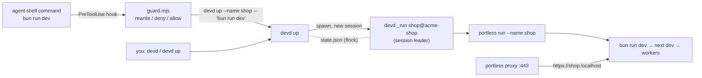

# How devd works



## Pieces

| Path | Role |
| --- | --- |
| `bin/devd` | entry point; puts `src/` on `sys.path` and calls `devd.cli.main` |
| `src/devd/cli.py` | argument parsing; bare `devd` in a terminal opens the panel |
| `src/devd/commands.py` | `up`, `ls`, `stop`, `restart`, `logs`, `keep`, `config`, `forget`, `prune`, `ui` |
| `src/devd/runner.py` | `_run`: the per-server session leader, idle watcher, exit classification |
| `src/devd/model.py` | status rules, budget, unmanaged server discovery |
| `src/devd/procs.py` | process table (`ps`), listeners (`lsof`), connections (`netstat`), kills |
| `src/devd/state.py` | `state.json` under an `fcntl` lock |
| `src/devd/naming.py` | ids, checkout roots, app names (asks the guard, so both use the same rules) |
| `src/devd/ui.py` | curses control panel; a client of the CLI (`devd ls --json` and friends) |
| `src/devd/install.py` | `setup` and `doctor` |
| `guard/guard.mjs` | the agent hook: classifies one shell command |
| `guard/guard` | POSIX launcher: finds Node (PATH, Homebrew, nvm) and fails open without it |
| `agents/` | the rule, skill and instruction block installed for agents |

## Starting a server

1. `devd up` resolves the checkout root (git top level), the app name, and the command (the package manager's `dev` script by default). If a record for that name and checkout is already running, it prints the URL and exits 0.
2. It checks who is asking. An agent is refused with exit 3 when the record is down because of the user or an outside kill. It gets exit 4 when the memory or server budget is full.
3. It spawns `devd _run <id>` with `start_new_session=True`. The runner is a session leader, so closing the agent's shell doesn't take the server with it.
4. The runner starts `portless run --name <name> -- <cmd>` (or the raw command with `--raw`). It sets `DEVD_ID=<id>` in the environment, so every descendant carries the tag, including processes that re-parent or daemonize.
5. `devd up` polls the state until the runner records a port that answers (`--wait`, 45 s by default). Then it prints the URL and returns. A child that exits during this wait is a startup failure (exit 1), and the last log lines are printed.

## Stopping and kill detection

- `devd stop` records `stopped_by` (user, agent, or idle) under the lock first. Then it signals the whole tagged family: SIGTERM, a short grace period, then SIGKILL. The runner sees its child exit, reads the existing `stopped` status, and leaves it alone.
- If the child dies without a devd stop, the runner classifies the exit. A signal exit, or a vanished process, is `killed`. A non-zero exit within 60 s of starting is `failed`. Anything later is `exited`.
- If the runner itself is gone (killed, reboot), `devd ls` checks each record's runner pid against its recorded start time. Records whose process no longer exists become `killed`.

## Idle detection

The runner wakes every 20 s (`DEVD_IDLE_TICK_S`) and counts the server as active if any of these happened since the last check:

- **CPU**: summed CPU time of the tagged process tree grew by at least 0.3 s. Dev servers idle at almost no CPU; a compile or a request costs far more.
- **Log**: the log file grew.
- **Network**: `netstat -anp tcp` shows a connection tuple on the server's port that it hasn't seen before. TIME_WAIT entries stay visible for about 30 s, so a single short request is still caught on the next tick.

`last_active` is written to the state about once a minute. When `now - last_active` passes the limit for whoever started the server, the runner marks it `stopped by idle` and kills the family. It also writes a line to the log and posts a macOS notification through `osascript`. `devd ls` reads listeners with `lsof` instead of connecting to ports, so listing never counts as activity.

## Servers devd did not start

`devd ls` also lists dev servers it does not own:

- portless routes whose process is alive but untagged;
- processes listening on TCP whose working directory is under `work_dirs`, walked up through wrapper processes (`bun run`, `npm run`, `sh -c`, `node .bin/next`) to the outermost one.

They count toward the budget. Only you can stop them; a stop adopts them as a `stopped by user` record, so agents won't start them again.

## The guard

`guardCommand(command, cwd)` returns one of three actions:

- **allow**;
- **rewrite**, with a new command;
- **deny**, with a reason the agent sees.

In order:

1. Unwrap `sh -c '…'` / `bash -lc "…"` and classify the inner command.
2. Deny commands that set `DEVD_ACTOR` themselves, or that strip the agent environment around devd (`env -i`, `unset CURSOR_AGENT`).
3. A `devd` call in command position: deny the user-only subcommands. Otherwise prefix `export DEVD_ACTOR=agent; ` so devd knows who is calling, even in harnesses that set no marker variable.
4. A `portless` call in command position: deny `--force`, `proxy stop`, `clean` and `service uninstall`; let read-only subcommands through; rewrite `portless run` and `portless <name> <cmd>` to `devd up`.
5. Dev servers started through tmux, screen, pm2, Orca or Paseo terminals are denied.
6. Anything else that looks like a dev server becomes `devd up`. This covers package manager `dev` scripts, configured `dev_scripts` and `dev_commands`, `next dev`, `vite`, `nest start --watch`, and `<pm> start` only where `wrap_start` says so.
   - It keeps a leading `cd`, which becomes `--cwd`.
   - It drops hard-coded `--port` / `-p` / `PORT=` so portless assigns one.
   - It passes `--raw` when the script already runs portless or turbo, or when `PORTLESS=0` is set.
   - It moves a trailing `&& …` or background part to run after `devd up`.
   - Commands matching `ignore` and the built-in exceptions are left alone.

Each harness gets the result in its own format:

| Mode | Input | Output |
| --- | --- | --- |
| `preToolUse` (Cursor) | `tool_input.command` | `{ permission, updated_input, agent_message }` |
| `beforeShellExecution` (Cursor) | `command` | `{ permission: allow \| deny, agent_message }`. A rewrite becomes a deny that tells the agent the exact `devd up` command, as a backstop for when `preToolUse` did not run. |
| `claude`, `codex` | `tool_input.command` | `{ hookSpecificOutput: { permissionDecision, permissionDecisionReason, updatedInput } }`, or nothing to allow |

Broken or empty input fails open.

## State

`~/.portless/devd/state.json` (or `$DEVD_STATE_DIR`):

```json
{
  "config": { "max_rss_mb": 8192, "max_servers": 5, "agent_idle_min": 15, "user_idle_min": 0 },
  "servers": {
    "shop@fix-cart": {
      "id": "shop@fix-cart", "name": "shop", "root": "…/.worktrees/fix-cart/acme-shop", "cwd": "…",
      "cmd": "bun run dev", "raw": false, "status": "running", "started_by": "agent",
      "started_at": 1790000000.0, "runner_pid": 4242, "runner_lstart": "…", "port": 4285,
      "hostname": "fix-cart.shop.localhost", "last_active": 1790000300.0, "log": "…/logs/shop@fix-cart.log"
    }
  }
}
```

Every read-modify-write holds an exclusive `flock` on `state.lock`, so the CLI, runners and the panel can work in parallel safely.
